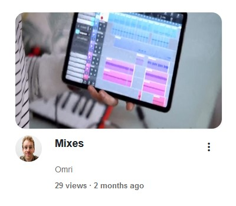

# Streambox - Wiki

1. [What is Streambox](#what-is-streambox)
2. [Build & Run](#how-to-build-and-run)
3. [Home Page](#home-page)
4. [Account Creation and Signing In](#account-creation-and-signing-in)
    * [Web Version](#account-creation-and-signing-in-web)
    * [Android App Version](#account-creation-and-signing-in-android)
5. [Video Management](#video-management)
    * [Web Version](#video-management-web)
    * [Android App Version](#video-management-android)

## What is Streambox
Streambox is a video-sharing platform, designed to emulate the core functionalities of popular streaming services. Available both as a web application and an Android app, Streambox provides users with an environment for uploading, viewing, and interacting with video content.  

## How to build and run

1. Navigate to "server/tcp-server/", and run the "make" command to compile the TCP server. Do note that the server must be run on POSIX compliant systems.
2. Run "./tcpServer" to start the server.

3. From a different terminal, navigate to "server/" and run "npm start". This will build and run the ReactJS and NodeJS apps.

4. Visit the [website](http://localhost:3000/), or run the android app using an emulator.

## Home Page
The Streambox Home page serves as the central hub for content discovery. Upon logging in, users are presented with a selection of videos based on their interests and viewing history.

### Navigation and Customization

In the web version, returning the Home page at any time can be achieved by clicking on any Streambox logo within each page. These logos serve as convenient navigation anchors throughout the platform.

Additionally, "Darkmode" Can be turned on by clicking the button at the top of the home page.

## Account Creation and Signing In

Streambox users can upload videos, comment, and have their recommended videos match their interest. Clicking on a user avatar navigates to his profile.

### <ins>Web Version</ins>

#### **Signing In**

To access your Streambox account:

1. Click the "Sign In" button at the top of any page.
2. Enter your username and password in the provided fields.
3. Click "Sign In" to access your account.

Users remain signed in for a set period before being automatically logged out for security purposes.

#### **Account Creation**

Creating a new Streambox account can be done as follows:

1. From the Sign In page, click the "Register" button.
2. Complete the registration form with required information.
3. Click "Create Account" to finalize registration.

### <ins>Android App Version</ins>

#### **Signing In**

To sign in to your Streambox account on the Android app:

1. Open the Streambox app.
2. Tap on the profile button at the bottom of the main screen.
3. Enter your username and password.
4. Tap "Sign In" to access your account.

After signing into your account, the profile button will navigate to your profile.

Users remain signed in for a set period before being automatically logged out for security purposes.

#### **Account Creation**

Creating a new Streambox account can be done as follows:

1. From the Sign In page, click the "Register" button.
2. Complete the registration form with required information.
3. Click "Create Account" to finalize registration.

## Video Management

Users who are logged in can upload, edit, and delete their videos. All video management operations are secured using JSON Web Token (JWT) authentication to ensure that users can only modify their own content.

### <ins>Web Version</ins>

#### **Uploading a Video**
To upload a video on the web platform:
1. Click the "Upload" button in the top-right corner of any page.
2. Select a video file from your computer or drag and drop it into the designated area.
3. Fill in the details, such as the title, description, and a thumbnail picture.
4. Click "Add" to make your video live.

#### **Accessing Video Options**
To access edit or delete options for any of your videos:
1. There are two ways to access the options:
    * Navigating to the video page, and clicking on the ellipsis (…) button to the right of the feedback buttons.
    * Hovering on a video in the feed, profile, or suggested video list, will reveal an ellipsis button.
2. Click on the ellipsis to reveal a dropdown menu with options to edit or delete the video.

**Note**: Deleted videos cannot be recovered, so please be certain before clicking the deletion button.

### <ins>Android App Version</ins>

#### **Uploading a Video**
To upload a video on the web platform:
1. Click the "Add Video" button in the bottom-right corner of the screen.
2. Select a video file from your phone.
3. Fill in the details, such as the title, description, and a thumbnail picture.
4. Click "Add" to make your video live.

#### **Accessing Video Options**
To access edit or delete options for any of your videos:
1. Tap the video to enter the viewing page.
2. Inside the video page, you will see buttons for editing and deletion below the video.

**Note**: Deleted videos cannot be recovered, so please be certain before clicking the deletion button.
